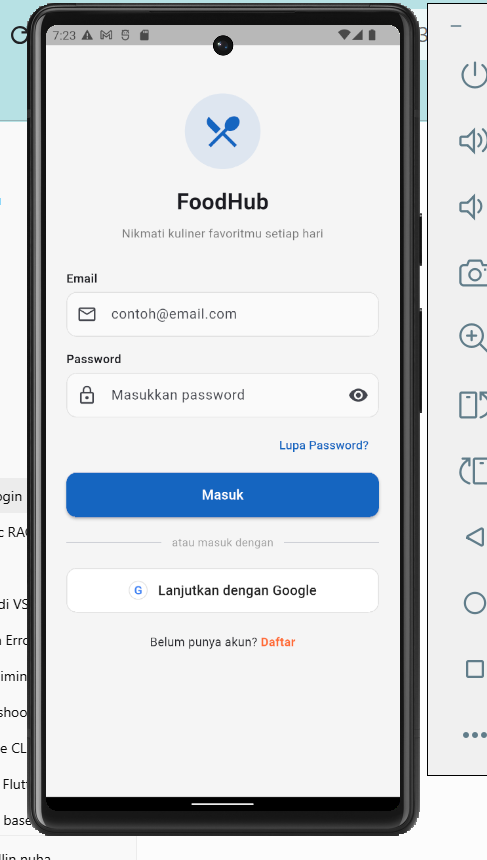
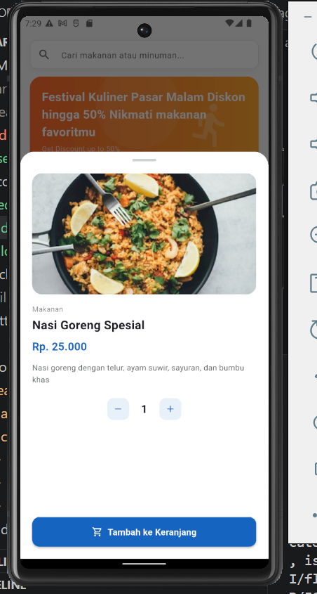
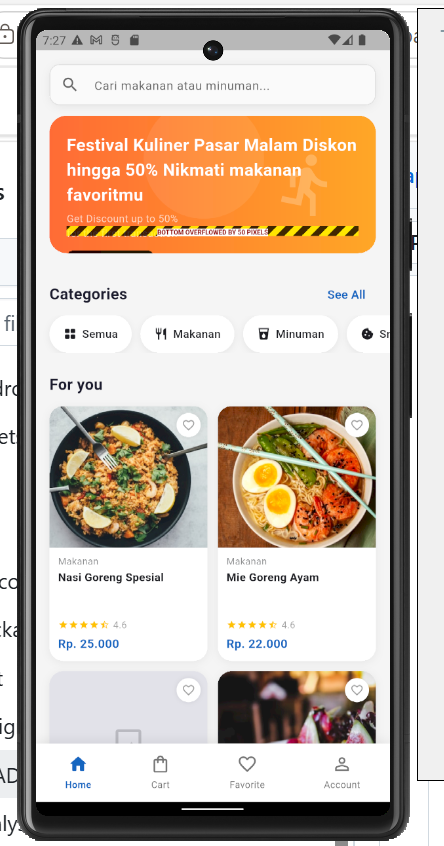

# pasar_malam

Aplikasi mobile marketplace jajanan pasar malam. User bisa browsing produk makanan & minuman, masukin ke keranjang, checkout, dan lihat status pesanan. Dibangun pakai Flutter dengan state management Provider.

# Struktur Project

```text
pasar_malam/
├── lib/
│   ├── core/
│   │   ├── constants/
│   │   │   ├── api_constants.dart
│   │   │   ├── app_colors.dart
│   │   │   └── app_strings.dart
│   │   ├── providers/
│   │   │   └── theme_provider.dart
│   │   ├── routes/
│   │   │   └── app_router.dart
│   │   ├── services/
│   │   │   ├── dio_client.dart
│   │   │   ├── secure_storage.dart
│   │   │   ├── notification_service.dart
│   │   │   ├── biometric_lock_provider.dart
│   │   │   └── global_institute_pay_service.dart
│   │   ├── theme/
│   │   │   └── app_theme.dart
│   │   └── widgets/
│   │       ├── biometric_lock_screen.dart
│   │       └── swiss.dart
│   │
│   ├── features/
│   │   ├── auth/
│   │   ├── dashboard/
│   │   ├── cart/
│   │   └── order/
│   │
│   ├── firebase_options.dart
│   └── main.dart
│
├── packages/
│   └── flutter_biometric_kit/
│
├── assets/
│   ├── icons/
│   └── readme/
│       ├── login.png
│       ├── dashboard.png
│       └── cart.png
│
├── pubspec.yaml
└── README.md
```


# Screenshoot
<p align="center">
  
  
  
</p>

# Teknologi

- Flutter
- Provider
- Firebase Authentication
- REST API
- MySQL